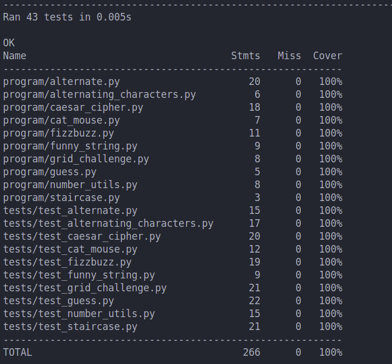

# 240-123-testing
## 6710110005 กรธัช สุขสวัสดิ์


```bash
Tree:
    program
    │── alternate.py
    │── alternating_characters.py
    │── caesar_cipher.py
    │── cat_mouse.py
    │── fizzbuzz.py
    │── funny_string.py
    │── grid_challenge.py
    │── guess.py
    │── number_utils.py
    │── staircase.py
    tests
    │── test_alternate.py
    │── test_alternating_characters.py
    │── test_caesar_cipher.py
    │── test_cat_mouse.py
    │── test_fizzbuzz.py
    │── test_funny_string.py
    │── test_grid_challenge.py
    │── test_guess.py
    │── test_number_utils.py
    │── test_staircase.py
    README.md
    image.png
```